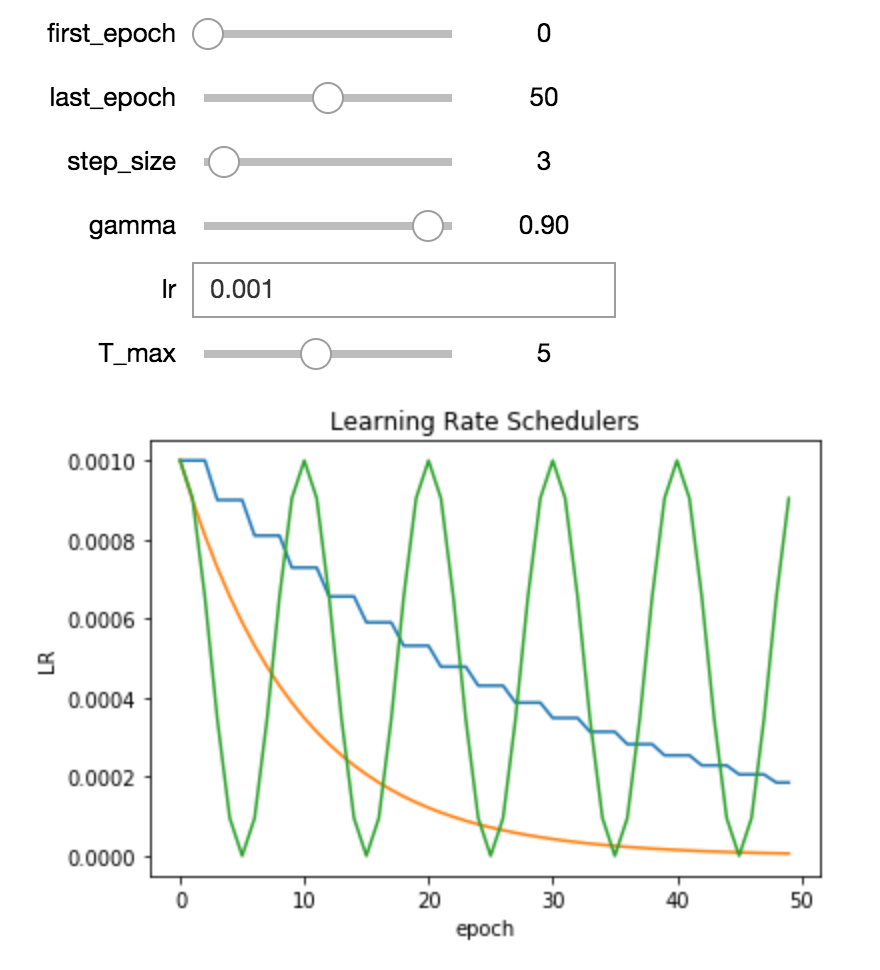

# Miscellaneous pytorch utilities, served as jupyter notebooks 

You can use nbviewer to render these notebooks, since github is failing to render these.
Unfortunately, [nbviewer](https://nbviewer.jupyter.org/) won't show you the interactive widgets of the notebooks, so you
will probsably want to open them in your own jupyter instance.

